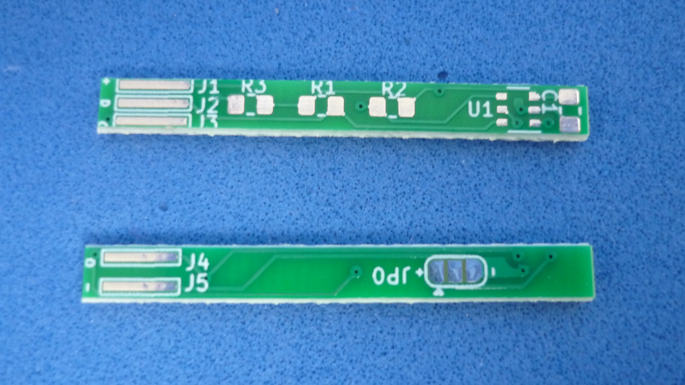
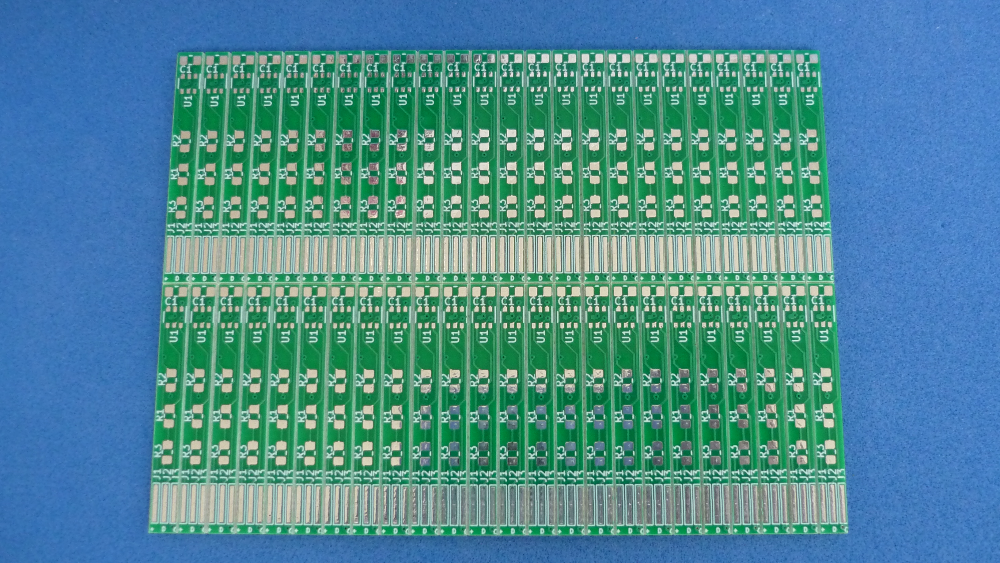

# PROBE STYLE I2C TEMPERATURE SENSOR PCB

Small circuit board(4.0x35mm), based on [PCT2074](assets/pdf/PCT2075.pdf) chip, designed to be installed inside a metal tube or thermowell.

## How to use this repository

The PCB was developed in KiCad V5.1,

## Directory structure

* The root folder contains template KiCad files: project, schematic and PCB 
* /modules folder contains additional footprints needed to edit printed circuit board
* /gerber folder contains ready to manufacture files.
* /assets folder contains support files for reade.md

## Board pinout

## Panelized boards

## Wired board

